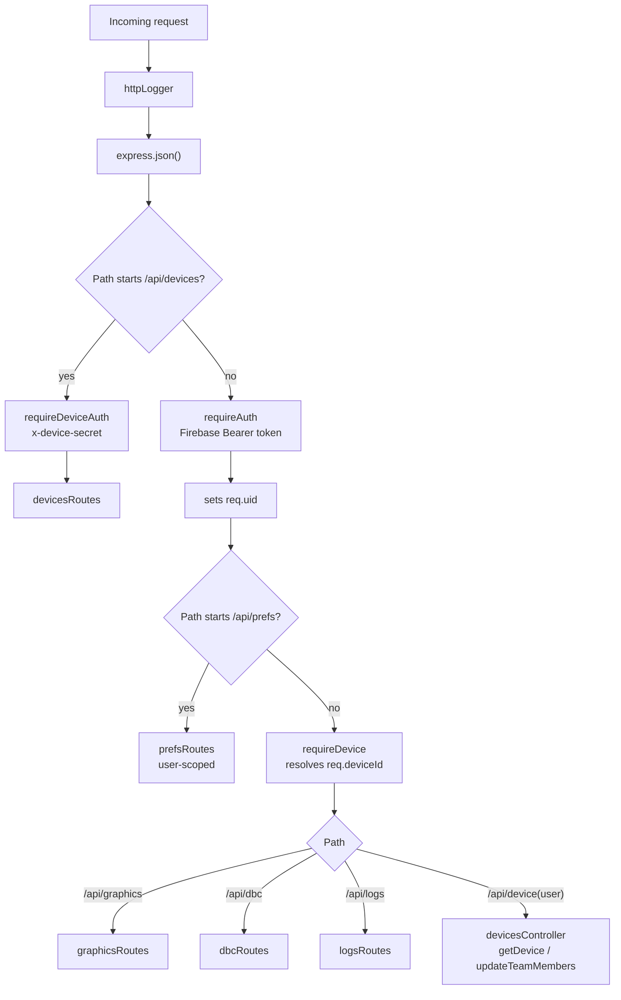

# Backend Architecture

## Tech Stack

| Layer | Library / Version |
|-------|-------------------|
| Runtime | Node.js 20 (CommonJS) |
| Framework | Express 5 |
| Language | TypeScript (strict) |
| Auth | Firebase Admin SDK (ID token verification) |
| Database | Firestore |
| WebSockets | `ws` |
| DBC parsing | `candied` |
| Dev tooling | `ts-node-dev`, `tsc` |

## Directory Layout

```
backend/
  src/
    server.ts                 # Entry point — starts Express + createRealtimeGateway on :3000
    app.ts                    # Middleware wiring + route mounts
    lib/
      firebaseAdmin.ts        # Firebase Admin SDK init (adminAuth, db)
    common/
      logger.ts               # Structured logger
      types/
        api.types.ts          # Shared response types
      system/                 # Deprecated stubs kept for reference (sendReloadSignal, atomicWriteJson)
    middleware/
      auth.ts                 # requireAuth — verifies Firebase ID token; sets req.uid
      deviceAuth.ts           # requireDeviceAuth — verifies x-device-secret header (Pi → server)
      deviceAccess.ts         # requireDevice — resolves req.deviceId from req.uid; 403 if unlinked
      httpLogger.ts           # Request logging
    modules/
      graphics/               # Screen CRUD (devices/{deviceId}/screens)
      dbc/                    # DBC file read/write/parse (devices/{deviceId}/dbc/content)
      devices/                # Pi registration + team-member management (top-level devices/{deviceId})
      logs/                   # Paginated log reads (devices/{deviceId}/logs/{chunkId})
      prefs/                  # Per-user screen prefs (users/{uid}/prefs/screens)
      realtime/               # WebSocket gateway + connection management
      sync/                   # Versioned file sync store (devices/{deviceId}/files/{fileId})
```

## Middleware chain

`app.ts` layers the middleware in a specific order so auth and device-resolution happen before any module sees the request:



The ordering means:
- **Pi-originated calls** hit `/api/devices/register` with `x-device-secret` and bypass Firebase auth entirely.
- **User-scoped prefs** skip `requireDevice` — a user can always read/write their own screen prefs even before being linked to a device.
- **Everything else under `/api/`** requires both a Firebase token and a linked device; returns 403 `Device not registered` otherwise.

## Module pattern

Every functional area follows the same four-file layout:

```
modules/<name>/
  <name>.routes.ts        # Router — maps HTTP verbs to controller functions
  <name>.controller.ts    # Request/response layer — parses params, calls service, formats response
  <name>.service.ts       # Firestore access and business logic
  <name>.types.ts         # Local type definitions
```

Shared response types live in `common/types/api.types.ts`. The `realtime` module also owns `realtime.gateway.ts` (wss server) and `realtime.service.ts` (connection registry + message handlers).

## Key design patterns

- **Persistence** — all user/device data is in Firestore; there are no local files, SQLite, or caches. `FieldValue.serverTimestamp()` is used for every `updatedAt` / `createdAt`.
- **Auth layers** — Firebase ID token for users, shared `x-device-secret` header for Pi. `req.uid` and `req.deviceId` are decorated by middleware; controllers trust them.
- **Cross-tab broadcast** — mutations in `graphics/` and `prefs/` call `broadcastToDeviceClients` / `broadcastToUserClients` (from `realtime.service`) so every open browser tab on the same device/user updates without polling.
- **Sync protocol** — writes to screens or DBC are mirrored into `devices/{deviceId}/files/{fileId}` as monotonic revisions. The Pi reconciles on reconnect via a `sync_state` message. See [sync-protocol.md](sync-protocol.md).
- **Idempotent commits** — the sync service uses `change_id` (UUIDs) so a repeated commit of the same change is a no-op rather than a duplicate revision.

## Module responsibilities

| Module | Firestore target | Purpose |
|---|---|---|
| `graphics` | `devices/{deviceId}/screens/{name}` | Screen CRUD; broadcasts `screen_updated` / `screen_deleted`; mirrors to `files/graphics` |
| `dbc` | `devices/{deviceId}/dbc/content` | Raw DBC write; parsed on read via `candied`; mirrors to `files/display_dbc` |
| `devices` | `devices/{deviceId}` | Pi device registration + team-member management |
| `logs` | `devices/{deviceId}/logs/{chunkId}` | Paginated log reads; chunk-aware cursor |
| `prefs` | `users/{uid}/prefs/screens` | Per-user pin + order for screen tabs |
| `realtime` | — (in-memory connection registry) | WSS gateway for both `/ws/pi` and `/ws/client`; message demux and fan-out |
| `sync` | `devices/{deviceId}/files/{fileId}` | Cloud ↔ Pi versioned file store; conflict-aware commit |

## What this backend does not do

- No local config files, no `SIGHUP`. Config reaches the Pi only via `/ws/pi`.
- No polling loops for Pi status beyond the 5 s stale-connection monitor in `realtime.service`.
- No test suite yet.
- No ORM — Firestore is accessed directly through `db` from `lib/firebaseAdmin`.
