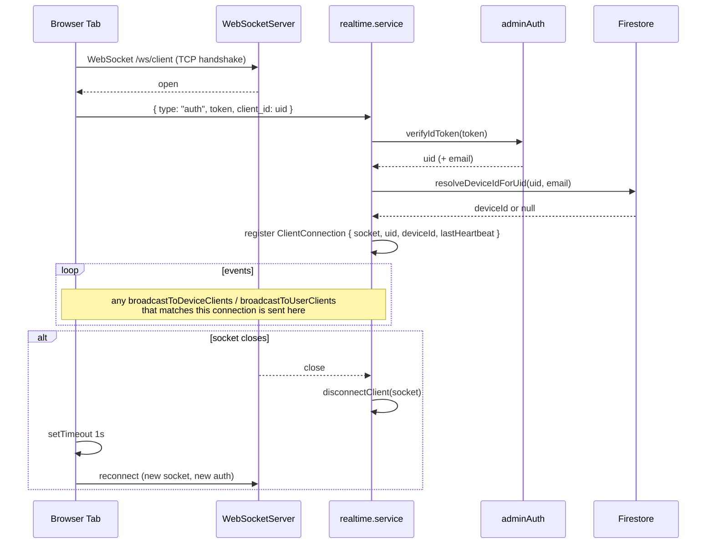

# Realtime WebSocket Gateway

The backend runs one `ws` WebSocket server attached to the Express HTTP server. Connections are routed by request path:

- `/ws/pi` — Pi ↔ backend (heartbeat, telemetry, GPS, binary log upload, Pi-initiated graphics / dbc uploads, cloud config pushes)
- `/ws/client` — browser ↔ backend (live telemetry / GPS fan-out, cross-tab editor events)

Connection management lives in `realtime.service.ts`. Path routing and lifecycle hooks live in `realtime.gateway.ts`.

---

## Connection registry

```
piSockets: Map<deviceId, PiConnection>           // at most one Pi per deviceId
socketToPiId: Map<WebSocket, deviceId>           // reverse lookup
clientSockets: Map<WebSocket, ClientConnection>  // many clients; tagged with { uid, deviceId? }
activeSessions: Map<filename, UploadSession>     // in-flight log uploads
```

- A second Pi WSS for the same `deviceId` displaces the first — the old socket is closed with `1000 "Pi web socket replaced"`.
- Client connections are **many-per-user**; there is no deduplication by `uid`. This is why multiple browser tabs work.
- A background timer (`PI_MONITOR_INTERVAL_MS = 5_000`) drops Pi sockets whose last heartbeat is older than `PI_DEADLINE_MS = 20_000` and purges stale upload sessions older than 5 min.

---

## `/ws/pi`

### Handshake

**Required headers:**
- `x-device-id: <deviceId>`
- `x-device-secret: <DEVICE_SECRET>` (matched against `process.env.DEVICE_SECRET`; skipped if the env var is empty — local dev)

Missing / wrong headers → server closes with `1008 Unauthorized` before any message is processed. The `deviceId` header is used purely as a gate — the Pi still has to echo `device_id` in its first `heartbeat` for the socket to be registered in the `piSockets` map.

### Messages from Pi → server

Every inbound JSON message may include a `device_id` field. The first `heartbeat` with a non-empty `device_id` registers the Pi into `piSockets` under that ID (and updates `devices/{deviceId}` to `connected: true`). Subsequent telemetry / GPS / upload messages inherit that registered ID.

| `type` | Purpose |
|---|---|
| `heartbeat` | Marks the Pi alive; triggers `registerDeviceHeartbeat(deviceId)` which updates `devices/{deviceId}.lastSeen` + `connected: true`. First heartbeat also registers the socket into `piSockets`. |
| `telemetry` | `{ payload: { signals: Record<name, number> } }` — fanned out to matching `/ws/client` sockets as `{ type: "Telemetry", device_id, payload }` |
| `gps` | `{ payload: { lat, lon, ... } }` — validated for finite `lat`/`lon` (warn + drop otherwise), fanned out to matching `/ws/client` sockets as `{ type: "gps", device_id, payload }` |
| `graphics_upload` | `{ payload: { screens: [...] } }` — replaces the full screen set for this device (`graphicsService.replaceAllScreensFromPi`) and re-emits one `screen_updated` per kept screen + one `screen_deleted` per removed screen on `/ws/client` |
| `dbc_upload` | `{ payload: "<raw .dbc text>" }` — stored via `dbcService.uploadDbc` |
| `log_upload_start` / `log_upload_chunk` / `log_upload_end` | Binary log upload (base64-encoded chunks); assembled + persisted via `persistLogBuffer` |

### Messages from server → Pi

Envelope: every message sent via `sendMessageToPi` is prefixed with `{ device_id, ...message }`.

| `type` | When |
|---|---|
| `config_update` | Sent by `sendConfigToPi` after every graphics upsert (`POST /api/graphics/screens/:id`). Payload is the full normalized `{ screens }` set with hex-encoded `can_id` / `x_can_id` fields. |
| `team_members_update` | Sent after `POST /api/device/team-members`. Payload is `{ team_members: string[] }`. |

There is **no** `sync_state` / `sync_plan` / `sync_download` / `sync_upload` / `sync_commit` / `sync_reject` message type, and no versioned file store. The config push is fire-and-forget — if the Pi isn't currently connected, `sendMessageToPi` returns `false` and the change is not replayed on reconnect.

See [sync-protocol.md](sync-protocol.md) for the (short) cloud ↔ Pi config exchange.

---

## `/ws/client`

### Handshake

TCP handshake is unauthenticated; the client must send an `auth` message **immediately after open** or the connection stays untagged (won't receive any events):

```json
{ "type": "auth", "token": "<Firebase ID token>", "client_id": "<uid>" }
```

The server calls `adminAuth.verifyIdToken(token)` and then `resolveDeviceIdForUid(uid, email?)` — which prefers the `users/{uid}.device_id` mapping and falls back to searching `devices` for a team-member email match, caching the result back into the user doc.

Once resolved, the `ClientConnection` is tagged `{ uid, deviceId }`.

### Server → client events

Every event is plain JSON.

| `type` | Match criterion | Fields | Emitted by |
|---|---|---|---|
| `Telemetry` | `deviceId` | `{ type, device_id, payload: { signals } }` | Forwarded from Pi telemetry |
| `gps` | `deviceId` | `{ type, device_id, payload: { lat, lon, ... } }` | Forwarded from Pi GPS |
| `screen_updated` | `deviceId` | `{ type, name, screen: ScreenInfo }` | `graphics.controller.updateScreen` and per-screen on Pi `graphics_upload` |
| `screen_deleted` | `deviceId` | `{ type, name }` | `graphics.controller.deleteScreenById` and per-removed-name on Pi `graphics_upload` |
| `screen_prefs_updated` | `uid` | `{ type, prefs: { pinnedNames, order } }` | `prefs.controller.updateScreenPrefs` |

The frontend's `TelemetryProvider` (in `state/TelemetryContext.tsx`) demuxes these into:
- ring-buffered signal history + flushed `rawMessages` for live display, and
- `editorReducer` dispatches for the three editor events.

### Reconnect behaviour

The client does not receive a dedicated `ping`/`pong`. If the socket closes for any reason (server restart, network blip), the client schedules a reconnect after 1 s and re-sends the `auth` message on the new socket. Every reconnect is a fresh entry in `clientSockets` — there is no session resumption on the server side.

---

## Client connection lifecycle



## Fan-out helpers

Three exported functions in `realtime.service.ts`:

| Function | Matches | Used by |
|---|---|---|
| `broadcastToDeviceClients(deviceId, message)` | all `/ws/client` tagged with `deviceId` | `graphics.controller` on screen write/delete; realtime service on Pi `graphics_upload` |
| `broadcastToUserClients(uid, message)` | all `/ws/client` tagged with `uid` | `prefs.controller` on pref PUT |
| `sendMessageToPi(deviceId, message)` | the single Pi connection for `deviceId` | `devices.controller.updateTeamMembers`, and indirectly via `sendConfigToPi` |
| `sendConfigToPi(deviceId, screenInfo)` | wraps `sendMessageToPi` with `{ type: "config_update", payload: <normalized screens> }` | `graphics.controller.updateScreen` via `pushFullConfigToPi` |

Each returns early if the target socket is missing or `readyState !== OPEN`. None of them throw on send errors — they log and move on.

---

## Log upload format

Binary logs are uploaded from the Pi as base64 chunks:

```
log_upload_start  → { filename, file_size }
log_upload_chunk  → { filename, chunk_index, data } × N
log_upload_end    → { filename, total_chunks }
```

The server buffers chunks in memory (`activeSessions`), assembles them on `log_upload_end`, decodes 24-byte entries (`int64 ts | uint32 can_id | uint32 pad | double value`), chunks by `MAX_ENTRIES_PER_CHUNK = 30_000`, and writes each chunk as one doc under `devices/{deviceId}/logs/`.

Uploads stuck for more than 5 minutes without an `_end` are dropped from the session map.
