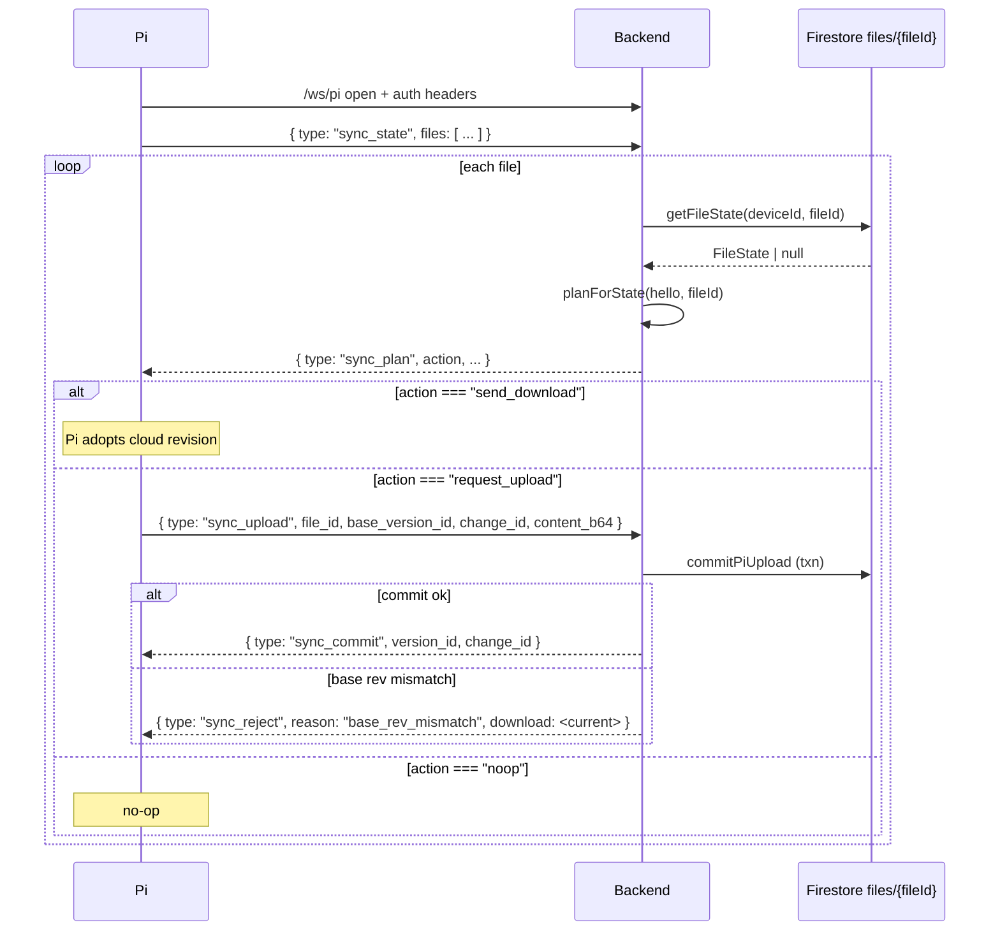

# Cloud ↔ Pi Sync Protocol

The backend ships two logical files to the Pi:

| `file_id` | Contents |
|---|---|
| `graphics` | Full screen list, serialised via `normalizeConfigForPi` (hex-encoded `can_id` fields) |
| `display_dbc` | Raw `.dbc` text |

Both are stored under `devices/{deviceId}/files/{fileId}` with a monotonic `version_id` so either side can detect a stale view and resolve it.

## File state shape

```typescript
FileState {
  file_id: string             // "graphics" | "display_dbc"
  version_id: number          // monotonic; starts at 1 on first commit
  content_b64: string         // base64 payload
  modified_by: "cloud" | "pi"
  modified_at_ms: number
  change_id: string           // UUID — idempotency key
  content_size: number
}
```

## Reconnect handshake at a glance



## Commit flow (cloud-originated)

```
Frontend POST /api/graphics/screens/:name
  → graphicsService.saveScreen                       (write devices/{deviceId}/screens/{name})
  → broadcastToDeviceClients screen_updated          (fan-out to sibling tabs)
  → pushFullConfigToPi:
      → graphicsService.getAllScreens                (rebuild full set)
      → normalizeConfigForPi                         (hex-encode can_id)
      → SyncService.commitCloudGeneratedGraphics     (new version_id in files/graphics)
      → sendSyncDownloadToPi                         (if Pi is connected)
```

`commitCloudGeneratedGraphics` uses a Firestore transaction to:
1. Read current `version_id` and `change_id` for the file.
2. If `change_id` matches → return the current state (no-op; idempotent).
3. Else increment `version_id`, overwrite `content_b64`, set `modified_by = "cloud"`, stamp `modified_at_ms`, store a new `change_id`.

The resulting `sync_download` message is the single source of truth for the Pi:

```json
{
  "type": "sync_download",
  "file_id": "graphics",
  "version_id": 42,
  "content_b64": "<base64 screens JSON>",
  "modified_by": "cloud",
  "modified_at_ms": 1712912400123
}
```

## Commit flow (Pi-originated)

The Pi can edit `graphics` (its own config) and `display_dbc` (user-uploaded `.dbc` on the Pi) locally and push them up:

```
Pi → /ws/pi { type: "sync_upload", file_id, base_version_id, change_id, content_b64 }

Backend:
  1. Validate payload (JSON for graphics, candied parse for dbc)
  2. SyncService.commitPiUpload (transaction)
       - if change_id already committed → return current state (idempotent)
       - if base_version_id !== current → throw BaseRevMismatchError
       - else increment + store; modified_by = "pi"
  3. Mirror the change back into domain stores:
       - graphicsService.replaceAllScreensFromPi (for graphics)
       - dbcService.uploadDbc (for display_dbc)
  4. Reply sync_commit { version_id, change_id } on success
  5. Reply sync_reject { reason: "base_rev_mismatch", download: <current> } on conflict
  6. Reply sync_reject { reason: "invalid_json" | "invalid_dbc" } on validation failure
```

## Reconnect handshake

On every Pi reconnect, the Pi sends a `sync_state` message summarising its view of each file:

```json
{
  "type": "sync_state",
  "device_id": "...",
  "files": [
    { "file_id": "graphics",    "version_id": 41, "pending_upload": false },
    { "file_id": "display_dbc", "version_id": 12, "pending_upload": true, "pending_base_version_id": 12 }
  ]
}
```

For each file the server responds with one `sync_plan`:

| Server sees | `action` |
|---|---|
| No cloud copy, Pi has `pending_upload` rooted at rev 0 | `request_upload` with `expected_base_version_id: 0` |
| No cloud copy, Pi has no pending upload | `noop` |
| Pi has `pending_upload` and `pending_base_version_id === cloud.version_id` | `request_upload` with `expected_base_version_id: cloud.version_id` |
| Pi has `pending_upload` but base rev is stale | `send_download` — Pi must drop its pending edit and re-base |
| Pi's `version_id === cloud.version_id` and no pending | `noop` |
| Pi's `version_id !== cloud.version_id` | `send_download` |

`send_download` inlines the full `sync_download` payload so the Pi can adopt immediately without a follow-up round-trip.

## Conflict resolution

The only conflict mode is **base-rev mismatch** (Pi based its edit on an older revision than what's currently in the cloud). There is no three-way merge — the cloud version wins, the Pi downloads it, and the user's Pi-side edits are discarded. This is acceptable because:

1. Simultaneous edits on both the Pi captive portal and the web UI are rare in practice.
2. The rejection includes the current download so the Pi can re-surface the latest state to the user.

## Service API

```typescript
// sync.service.ts
GRAPHICS_FILE_ID: "graphics"
DISPLAY_DBC_FILE_ID: "display_dbc"
SYNC_PROTOCOL_VERSION: number

stableStringify(value): string
getFileState(deviceId, fileId): Promise<FileState | null>
buildDownloadMessage(state): SyncDownloadMessage
planForState(deviceId, hello, fileId): Promise<SyncPlanMessage>
commitCloudGeneratedGraphics(deviceId, payload): Promise<FileState>
commitCloudRawFile(deviceId, fileId, raw): Promise<FileState>
commitPiUpload(deviceId, fileId, content, change_id, base_version_id): Promise<{ state, alreadyCommitted }>
```

`BaseRevMismatchError.current: FileState` is used by `realtime.service` to build the `sync_reject` response.
