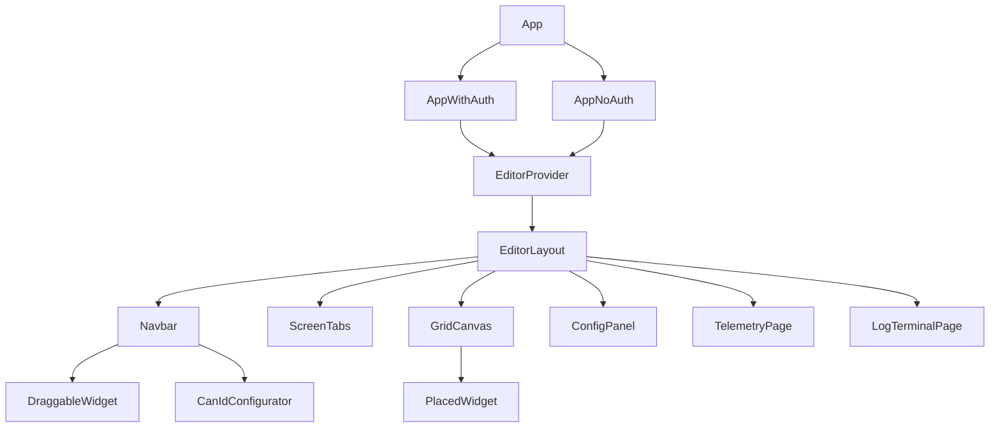

# Frontend Architecture

## Tech Stack

| Layer | Library / Version |
|-------|-------------------|
| Framework | React 18.3 |
| Language | TypeScript 5.7 (strict) |
| Bundler | Vite 6.1 |
| Styling | Tailwind CSS 3.4 |
| Auth | Firebase 12 (Auth + Firestore) |
| Drag & drop | @dnd-kit/core 6 + @dnd-kit/modifiers 9 |
| Icons | lucide-react |
| IDs | uuid 11 |

## Directory Layout

```
frontend/
  src/
    main.tsx                  # React root mount
    App.tsx                   # Auth branch: AppWithAuth (auth on) or AppNoAuth (auth off)
    AppWithAuth.tsx           # Firebase auth gate — shows LandingPage until user signs in
    EditorLayout.tsx          # Main shell: Navbar + ScreenTabs + GridCanvas + ConfigPanel
                              #   also mounts TelemetryPage and LogTerminalPage (page-switched)
    types.ts                  # All shared types — single source of truth
    index.css                 # Tailwind base imports + global resets
    components/
      LandingPage.tsx         # Sign-in entry screen
      Navbar.tsx              # Left sidebar: DBC upload, screen controls, save/delete, driver display
      ScreenTabs.tsx          # Tab strip: switch, rename, create, delete screens
      GridCanvas.tsx          # 10x6 droppable grid surface
      PlacedWidget.tsx        # Widget instance on canvas (draggable, clickable)
      DraggableWidget.tsx     # Widget in palette (drag source only)
      ConfigPanel.tsx         # Right panel: property editor for selected widget
      CanIdConfigurator.tsx   # Modal: add/edit/delete CAN frames and signals
      TelemetryPage.tsx       # Live WebSocket telemetry dashboard
      LogTerminalPage.tsx     # Paginated log terminal (infinite scroll)
      ui/                     # Decorative background components (dots, grid patterns)
    state/
      EditorContext.tsx       # React Context + EditorProvider + useEditorState/useEditorDispatch
      editorReducer.ts        # Pure reducer — all state transitions, createInitialState()
    lib/
      firebase.ts             # Firebase SDK init (auth, app)
      utils.ts                # General utilities
    utils/
      layoutIO.ts             # Backend API client: authFetch + all screen/DBC/driver-display calls
      widgetDefaults.ts       # defaultSize and allowedSizes per widget type; GRID_COLS/ROWS constants
      gridHelpers.ts          # pixelToGrid(), hasCollision(), clampToGrid()
```

## Component Hierarchy



`TelemetryPage` and `LogTerminalPage` are rendered conditionally based on the `page` state variable in `EditorLayout` (`"display"` | `"telemetry"` | `"logs"`). There is no URL router — all navigation is in-component state.

## State Management

All editor state is managed through a single `useReducer` in `EditorProvider` (`state/EditorContext.tsx`). Components read state via `useEditorState()` and mutate it via `useEditorDispatch()`.

### EditorState shape

```typescript
{
  screens: ScreenState[]           // all open screens (each has id, name, widgets[], isDirty)
  activeScreenId: string           // which screen is visible on the canvas
  selectedWidgetId: string | null  // which widget ConfigPanel is editing
  frameParserConfig: FrameParserConfig  // CAN frame definitions, keyed by "0x..." hex ID
  driverDisplayScreen: string | null    // which screen name is shown on the car
  driverDisplayDirty: boolean      // unsaved driver display change
  canIdsDirty: boolean             // unsaved CAN frame changes
}
```

### Action types (22 total)

| Domain | Actions |
|--------|---------|
| Widget | `ADD_WIDGET`, `MOVE_WIDGET`, `RESIZE_WIDGET`, `REMOVE_WIDGET`, `SELECT_WIDGET`, `UPDATE_WIDGET_DATA` |
| Screen | `ADD_SCREEN`, `REMOVE_SCREEN`, `SET_ACTIVE_SCREEN`, `SET_SCREEN_NAME`, `CLEAR_SCREEN`, `LOAD_SCREEN`, `UPDATE_ORIGINAL_NAME` |
| Dirty flags | `MARK_CLEAN`, `MARK_DRIVER_DISPLAY_CLEAN`, `MARK_CAN_IDS_CLEAN` |
| CAN frames | `SET_FRAME_PARSER_CONFIG`, `ADD_CAN_FRAME`, `UPDATE_CAN_FRAME`, `REMOVE_CAN_FRAME` |
| Driver display | `SET_DRIVER_DISPLAY`, `LOAD_DRIVER_DISPLAY` |

### EditorProvider side-effects

1. **On mount** — fetches `GET /api/dbc` and `GET /api/graphics/driver-display` in parallel, dispatches `SET_FRAME_PARSER_CONFIG` and `LOAD_DRIVER_DISPLAY`.
2. **On any dirty flag** — registers a `beforeunload` event to warn the user about unsaved changes.

## Grid System

| Constant | Value |
|----------|-------|
| `GRID_COLS` | 10 |
| `GRID_ROWS` | 6 |
| Cell size | 80 × 80 px (800 × 480 display target) |

Widget default and allowed sizes (`utils/widgetDefaults.ts`):

| Widget type | Default | Allowed sizes (cols × rows) |
|-------------|---------|------------------------------|
| `gauge` | 2×2 | 2×2, 3×3 |
| `number` | 2×1 | 1×1, 2×1, 3×1 |
| `bar` | 3×1 | 2×1, 3×1, 4×1, 1×2, 1×3 |
| `graph` | 4×2 | 3×2, 4×2, 5×3 |
| `indicator` | 1×1 | 1×1 (fixed) |

Grid helper functions (`utils/gridHelpers.ts`):

- `pixelToGrid(px, py, cellW, cellH)` — converts screen pixel coords to 0-based grid cell
- `hasCollision(col, row, cols, rows, widgets, excludeId?)` — returns `true` if out-of-bounds or overlapping another widget
- `clampToGrid(col, row, cols, rows)` — clamps a position so the widget fits within the 10×6 grid

## Backend API Surface

All calls go through `authFetch` in `utils/layoutIO.ts`, which attaches the Firebase ID token when auth is enabled.

| Endpoint | Method | Purpose |
|----------|--------|---------|
| `/api/graphics/screens` | GET | List saved screen names |
| `/api/graphics/screens/{name}` | GET | Load a screen by name |
| `/api/graphics/screens/{name}` | POST | Save a screen |
| `/api/graphics/screens/{name}` | DELETE | Delete a screen |
| `/api/graphics/driver-display` | GET | Get current driver display screen name |
| `/api/graphics/driver-display` | POST | Set driver display screen name |
| `/api/dbc` | GET | Get CAN frame definitions |
| `/api/dbc` | POST | Save CAN frame definitions |
| `/api/dbc/upload` | POST | Parse a raw .dbc file and return frame config |
| `/api/logs` | GET | Paginated telemetry log entries |
| `ws://{host}/ws/client` | WebSocket | Live telemetry stream |

### Coordinate translation

The frontend stores widget positions as 0-based grid cells (`col`, `row`, `cols`, `rows`). The backend uses a `position: { x, y, width, height }` object. `widgetToBackend()` and `widgetFromBackend()` in `layoutIO.ts` handle this translation. CAN IDs are hex strings (`"0x100"`) in the frontend and integers in the backend.
