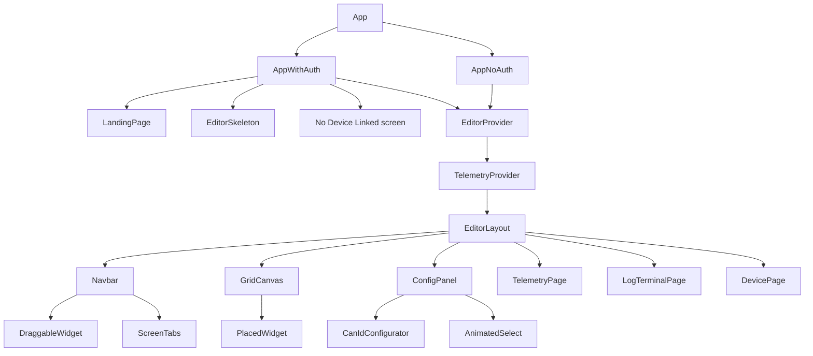

# Frontend Architecture

## Tech Stack

| Layer | Library / Version |
|-------|-------------------|
| Framework | React 18.3 |
| Language | TypeScript 5.7 (strict) |
| Bundler | Vite 6.1 |
| Styling | Tailwind CSS 3.4 |
| Auth | Firebase 12 (Auth + Firestore) |
| Drag & drop | @dnd-kit/core 6 + @dnd-kit/sortable + @dnd-kit/modifiers |
| Icons | lucide-react |
| IDs | uuid 11 |

## Directory Layout

```
frontend/
  src/
    main.tsx                  # React root mount
    App.tsx                   # Auth branch: AppWithAuth (auth on) or AppNoAuth (auth off)
    AppWithAuth.tsx           # Firebase auth gate — LandingPage → EditorSkeleton → EditorLayout
                              #   Also detects device-unregistered state and shows "No Device Linked" screen
    EditorLayout.tsx          # Main shell: top nav (4 pages) + page switch
                              #   Pages: Screen Editor, Live Telemetry, Log Terminal, Device
    types.ts                  # All shared types — single source of truth
    index.css                 # Tailwind base imports + global resets + custom animations
    components/
      LandingPage.tsx         # Sign-in entry screen
      Navbar.tsx              # Left sidebar (Editor page): DBC upload, widget palette, ScreenTabs, Save/Clear/Delete
      ScreenTabs.tsx          # Pinned + drag-reorder-able + bulk-selectable screen tab list
      GridCanvas.tsx          # 10x6 droppable grid surface
      PlacedWidget.tsx        # Widget instance on canvas (draggable, clickable)
      DraggableWidget.tsx     # Widget in palette (drag source only)
      ConfigPanel.tsx         # Right panel: property editor for selected widget + embedded CanIdConfigurator
      CanIdConfigurator.tsx   # Inline panel: add/edit/delete CAN frames and signals
      AnimatedSelect.tsx      # Custom animated select dropdown (used throughout ConfigPanel)
      TelemetryPage.tsx       # Live WebSocket telemetry dashboard — one GraphCard per live signal
      LogTerminalPage.tsx     # Split-panel log viewer: history (left) + live feed (right); CSV export
      DevicePage.tsx          # Device ID display + team-member management
      EditorSkeleton.tsx      # Shimmer loading state (+ useDeferredSkeleton hook)
      ui/                     # Decorative background components (dots, grid patterns)
    state/
      EditorContext.tsx       # EditorProvider + useEditorState/useEditorDispatch
                              #   Loads DBC + all screens + screen prefs on mount;
                              #   debounced auto-save for prefs (400 ms)
      TelemetryContext.tsx    # TelemetryProvider — maintains /ws/client connection with auto-reconnect,
                              #   demuxes telemetry + cross-tab events (screen_updated / screen_deleted /
                              #   screen_prefs_updated) and dispatches them into EditorContext
      editorReducer.ts        # Pure reducer — all state transitions, createInitialState()
    lib/
      firebase.ts             # Firebase SDK init (auth, app, db)
      utils.ts                # General utilities
    utils/
      layoutIO.ts             # Backend API client: authFetch + all screen/DBC/prefs/logs calls
                              #   Throws DeviceNotRegisteredError on 403 so the UI can route to the
                              #   "No Device Linked" screen
      widgetDefaults.ts       # defaultSize and allowedSizes per widget type; GRID_COLS/ROWS constants
      gridHelpers.ts          # pixelToGrid(), hasCollision(), clampToGrid()
```

## Component Hierarchy



The four pages (`display` | `telemetry` | `logs` | `device`) are conditionally rendered in `EditorLayout` based on a local `page` state variable. There is no URL router — all navigation is in-component state.

## State Management

All editor state is managed through a single `useReducer` in `EditorProvider` (`state/EditorContext.tsx`). Components read state via `useEditorState()` and mutate it via `useEditorDispatch()`.

Live telemetry plus the cross-tab WebSocket is owned by `TelemetryProvider` (`state/TelemetryContext.tsx`) which reads via `useTelemetry()`. `TelemetryProvider` is nested inside `EditorProvider` so it can dispatch editor actions when remote change events arrive.

### EditorState shape

```typescript
{
  screens: ScreenState[]           // all open screens (each has id, name, originalName?, widgets[], isDirty?)
  activeScreenId: string           // which screen is visible on the canvas
  selectedWidgetId: string | null  // which widget ConfigPanel is editing
  frameParserConfig: FrameParserConfig  // CAN frame definitions, keyed by "0x..." hex ID
  canIdsDirty: boolean             // unsaved CAN frame changes

  // Screen prefs (pinned + manual order) — per-user, auto-saved
  pinnedScreenNames: Set<string>
  screenOrder: string[]
  prefsDirty: boolean
}
```

`ScreenState.originalName` tracks the last-saved name so the tab strip can distinguish "saved" from "draft" screens, detect renames, and issue a paired `deleteScreen(oldName)` + `saveScreen(newName)` on rename.

### Action types

The reducer handles 30 action types grouped as follows:

| Domain | Actions |
|--------|---------|
| Widget | `ADD_WIDGET`, `MOVE_WIDGET`, `RESIZE_WIDGET`, `REMOVE_WIDGET`, `SELECT_WIDGET`, `UPDATE_WIDGET_DATA` |
| Screen (single) | `ADD_SCREEN`, `REMOVE_SCREEN`, `SET_ACTIVE_SCREEN`, `SET_SCREEN_NAME`, `UPDATE_ORIGINAL_NAME`, `CLEAR_SCREEN`, `LOAD_SCREEN` |
| Screen (bulk / remote) | `LOAD_ALL_SCREENS`, `UPSERT_SCREEN`, `REMOVE_SCREEN_BY_NAME`, `REMOVE_SCREENS_BY_IDS`, `CLEAR_SCREENS_BY_IDS` |
| Dirty flags | `MARK_CLEAN`, `MARK_CAN_IDS_CLEAN`, `MARK_PREFS_CLEAN` |
| CAN frames | `SET_FRAME_PARSER_CONFIG`, `ADD_CAN_FRAME`, `UPDATE_CAN_FRAME`, `REMOVE_CAN_FRAME` |
| Screen prefs | `SET_SCREEN_PREFS`, `TOGGLE_PIN_SCREEN`, `REORDER_SCREENS`, `RENAME_SCREEN_IN_PREFS`, `CLEANUP_STALE_PREFS` |

`UPSERT_SCREEN` and `REMOVE_SCREEN_BY_NAME` exist so the backend's cross-tab broadcast can surgically apply changes to sibling tabs without disturbing local dirty work. `UPSERT_SCREEN` is a no-op against screens that are currently dirty locally.

### EditorProvider side-effects

1. **On mount** — fetches `GET /api/dbc`, `GET /api/graphics/screens` (then `GET` each screen), and `GET /api/prefs/screens` in parallel. Dispatches `SET_FRAME_PARSER_CONFIG`, `LOAD_ALL_SCREENS`, and `SET_SCREEN_PREFS`. After both screens and prefs are loaded, dispatches `CLEANUP_STALE_PREFS` to drop any pinned/ordered names that no longer match a saved screen.
2. **On any `prefsDirty` change** — 400 ms debounced `PUT /api/prefs/screens`, then `MARK_PREFS_CLEAN`. Silently leaves `prefsDirty = true` on failure so it retries on the next mutation.
3. **On any unsaved state (CAN IDs dirty or any screen dirty)** — attaches a `beforeunload` handler to warn the user.

Note: the active-screen save flow is handled by `Navbar.executeSave`, which saves **every dirty screen in parallel** plus the DBC (if `canIdsDirty`) on a single click.

### TelemetryProvider side-effects

1. **On mount** — opens `/ws/client`, sends `{ type: "auth", token, client_id }` after `open`, and re-connects with a 1 s delay on close.
2. **On message** — demuxes by `type`:
   - `Telemetry` → updates the `signals` ring buffer (30 values/signal) and enqueues `rawMessages` (500-deep, flushed on a 50 ms timer to limit re-renders).
   - `screen_updated` → `dispatch({ type: "UPSERT_SCREEN", ... })`.
   - `screen_deleted` → `dispatch({ type: "REMOVE_SCREEN_BY_NAME", ... })`.
   - `screen_prefs_updated` → `dispatch({ type: "SET_SCREEN_PREFS", ... })`.

## Grid System

| Constant | Value |
|----------|-------|
| `GRID_COLS` | 10 |
| `GRID_ROWS` | 6 |
| Cell size | Computed from container; design target 80 × 80 px on the 800 × 480 on-car display |

Widget default and allowed sizes (`utils/widgetDefaults.ts`):

| Widget type | Default | Allowed sizes (cols × rows) |
|-------------|---------|------------------------------|
| `gauge` | 2×2 | 2×2, 3×3 |
| `number` | 2×1 | 1×1, 2×1, 3×1 |
| `bar` | 3×1 | 2×1, 3×1, 4×1, 1×2, 1×3 |
| `graph` | 4×2 | 3×2, 4×2, 5×3 |
| `indicator` | 1×1 | 1×1 (fixed) |

Grid helper functions (`utils/gridHelpers.ts`):

- `pixelToGrid(px, py, cellW, cellH)` — converts screen pixel coords to 0-based grid cell
- `hasCollision(col, row, cols, rows, widgets, excludeId?)` — returns `true` if out-of-bounds or overlapping another widget
- `clampToGrid(col, row, cols, rows)` — clamps a position so the widget fits within the 10×6 grid

## Backend API Surface

All calls go through `authFetch` in `utils/layoutIO.ts`, which attaches the Firebase ID token when auth is enabled and throws `DeviceNotRegisteredError` on 403.

| Endpoint | Method | Purpose |
|----------|--------|---------|
| `/api/graphics/screens` | GET | List saved screen names |
| `/api/graphics/screens/{name}` | GET | Load a screen by name |
| `/api/graphics/screens/{name}` | POST | Save a screen (broadcasts `screen_updated` + commits to sync store) |
| `/api/graphics/screens/{name}` | DELETE | Delete a screen (broadcasts `screen_deleted` + commits to sync store) |
| `/api/dbc` | GET | Get parsed CAN frame definitions |
| `/api/dbc` | POST | Save CAN frame definitions |
| `/api/dbc/upload` | POST | Parse raw .dbc text and return `FrameParserConfig` |
| `/api/prefs/screens` | GET | Read per-user screen prefs (`{ pinnedNames, order }`) |
| `/api/prefs/screens` | PUT | Write per-user screen prefs (broadcasts `screen_prefs_updated`) |
| `/api/logs/days` | GET | List available log days with per-day entry counts |
| `/api/logs` | GET | Paginated log entries (`?date=&limit=&before=`) |
| `/api/device` | GET | Get device info for the current user |
| `/api/device/team-members` | POST | Update team-member emails for the linked device |
| `ws://{host}/ws/client` | WebSocket | Live telemetry + cross-tab editor events |

### Coordinate translation

The frontend stores widget positions as 0-based grid cells (`col`, `row`, `cols`, `rows`). The backend uses a `position: { x, y, width, height }` object. `widgetToBackend()` and `widgetFromBackend()` in `layoutIO.ts` handle this translation. CAN IDs are hex strings (`"0x100"`) in the frontend and integers in the backend (with `can_id_label` resolved from `frameParserConfig` during save).

## Page Loading Skeleton

`EditorSkeleton` provides a shimmer placeholder for the initial mount. `useDeferredSkeleton(active)` only renders it after a 150 ms delay (to avoid flash on fast connections) and pins it for a 300 ms minimum once shown (to avoid a jarring pop-in → pop-out).
