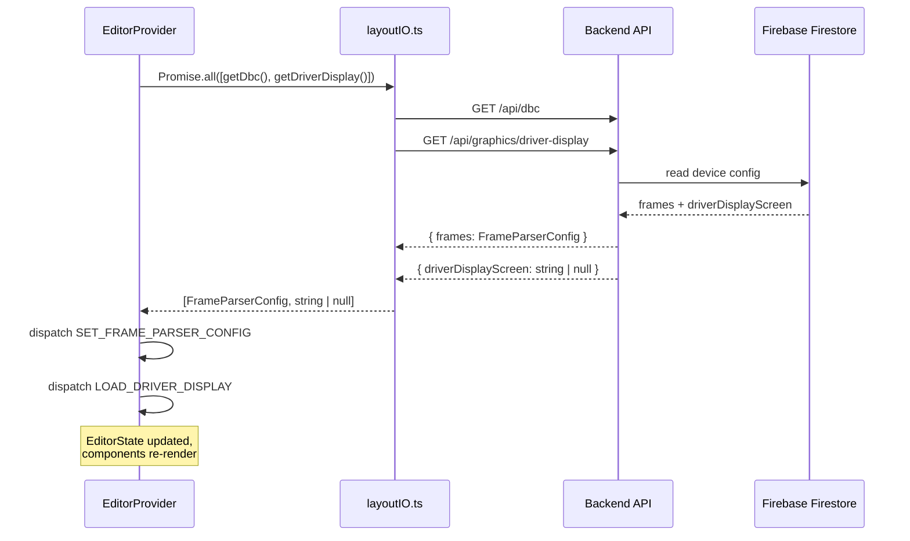
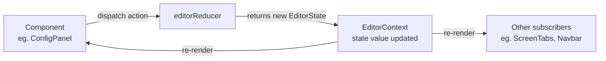
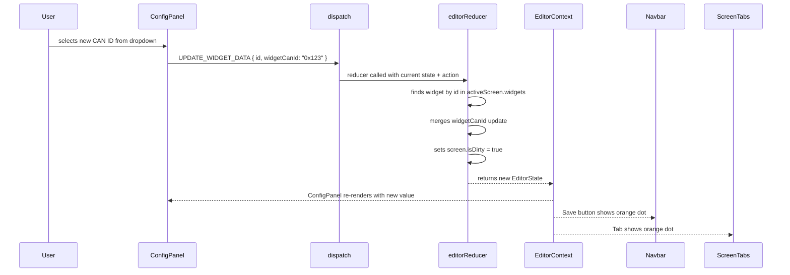
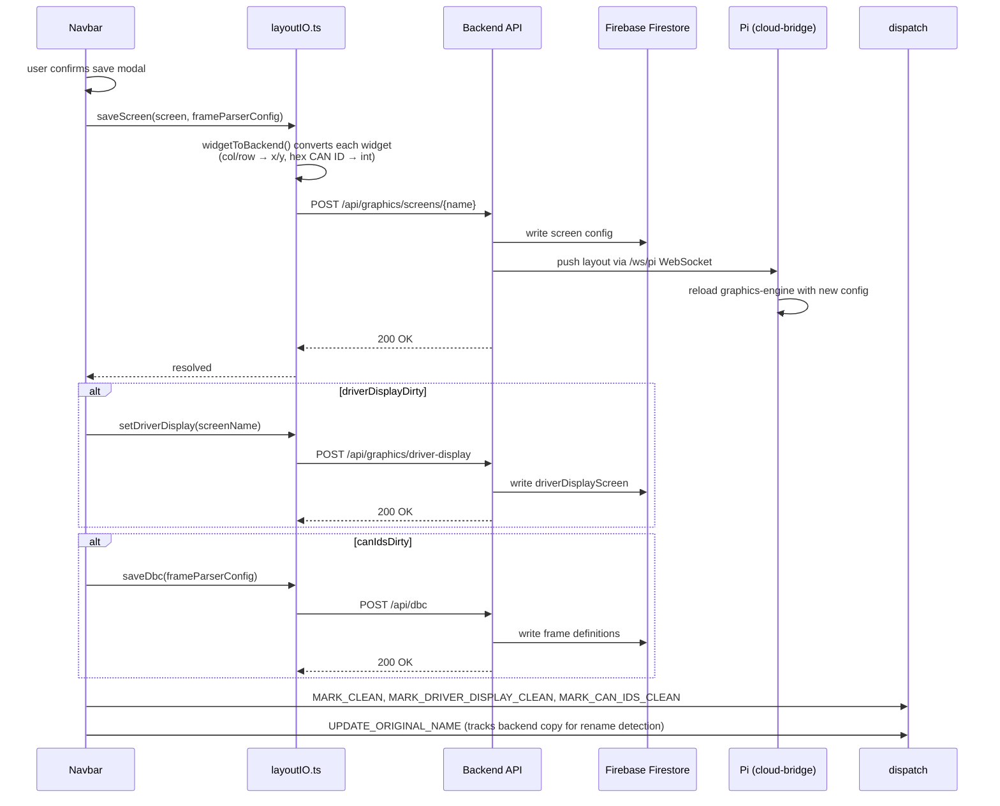
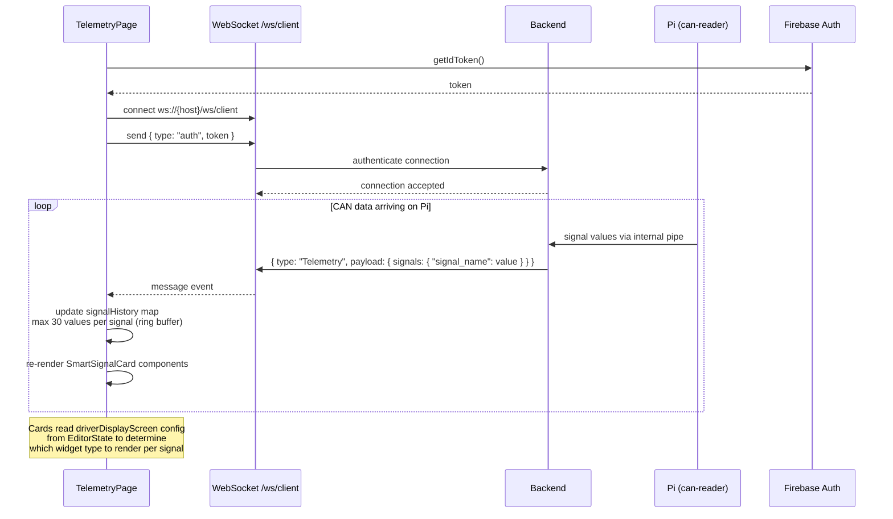
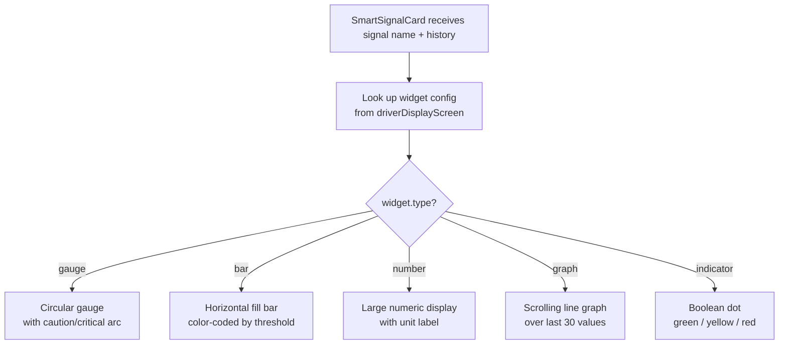
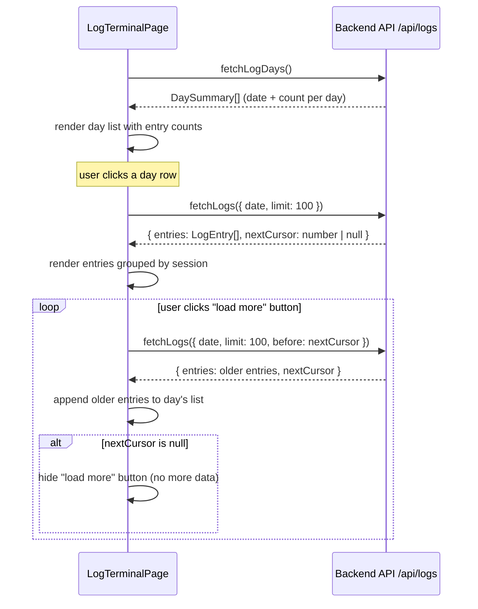
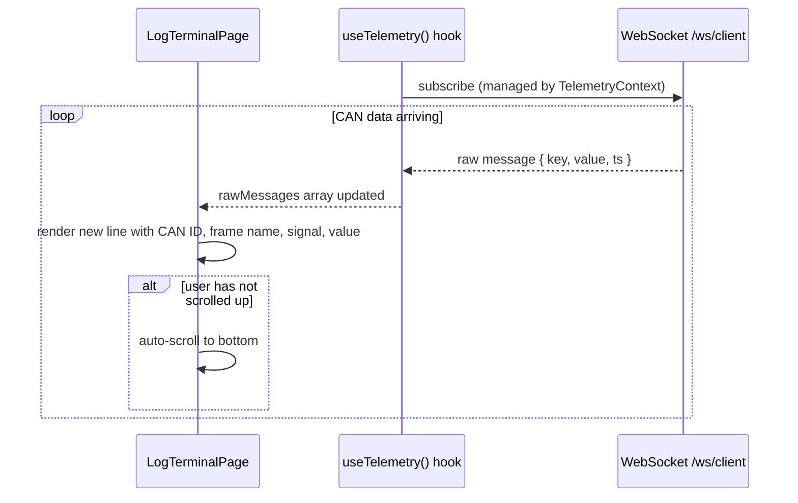
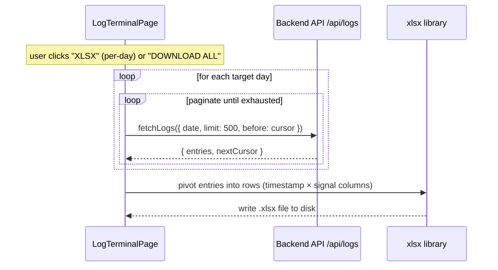

# Data Flow Diagrams

These diagrams show how data moves through the system — state mutations, API interactions, WebSocket streams, and pagination.

---

## 1. Initial Data Load

When `EditorProvider` mounts, it fetches the current CAN frame definitions and driver display setting from the backend in parallel before any user interaction.



---

## 2. State Mutation Pipeline

Every user action that changes editor state follows this path. No component mutates state directly.



**Action lifecycle example — editing a widget's CAN ID:**



---

## 3. Save Sequence

Saving pushes the current state to the backend, which persists to Firestore and relays config to the Pi over WebSocket.



---

## 4. Live Telemetry Flow

`TelemetryPage` opens a WebSocket to the backend and renders live signal values using the driver display screen's widget configuration.



**SmartSignalCard rendering logic:**



---

## 5. Log Viewer Flow

`LogTerminalPage` is a resizable split-panel: history (left) and live feed (right). The divider is draggable, and the split percentage is persisted in `localStorage` under `log-split-pct`.

### 5a. History Panel

On mount, day summaries are fetched. The user expands a day to load its entries, then clicks "load more" to paginate.



### 5b. Live Feed Panel

The right panel streams live telemetry via the existing `useTelemetry()` hook and auto-scrolls to the bottom unless the user has scrolled up.



### 5c. XLSX Export

Export fetches all pages for the target day(s), pivots entries into a timestamp-by-signal grid, and writes an Excel file via the `xlsx` library.



**LogEntry shape:**

```typescript
{
  ts: number           // Unix timestamp (ms)
  can_id: number       // integer CAN ID
  value: number        // decoded signal value
  session: string      // session identifier
  frame_name: string | null  // resolved from DBC, null if unknown
}
```
