# Data Flow Diagrams

These diagrams show how data moves through the system — state mutations, API interactions, WebSocket streams, cross-tab sync, and CSV export.

---

## 1. Initial Data Load

When `EditorProvider` mounts, it fetches the DBC, every saved screen, and the user's screen prefs in parallel. Once both screens and prefs have arrived it dispatches `CLEANUP_STALE_PREFS` to drop pinned/ordered names that no longer map to a live screen.

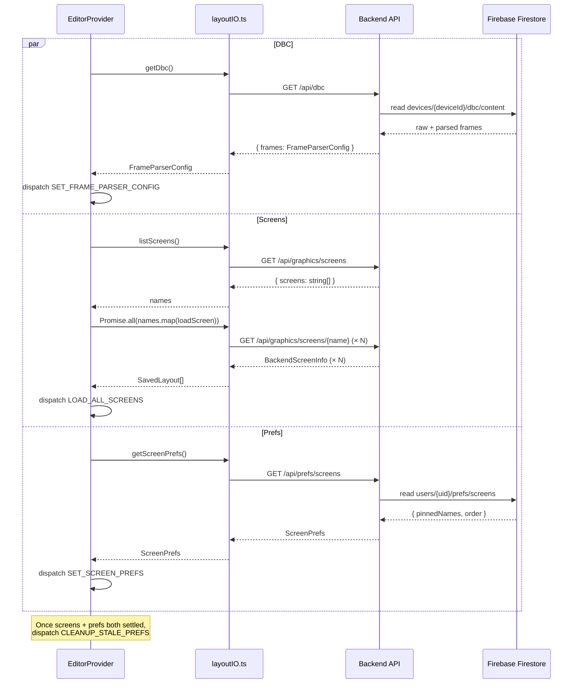

If `listScreens()` throws `DeviceNotRegisteredError` (HTTP 403), `AppWithAuth` routes to the "No Device Linked" screen instead of mounting `EditorProvider`.

---

## 2. State Mutation Pipeline

Every user action that changes editor state follows this path. No component mutates state directly.

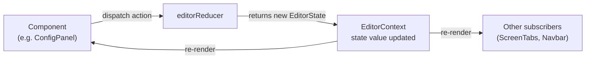

**Action lifecycle example — editing a widget's CAN ID:**

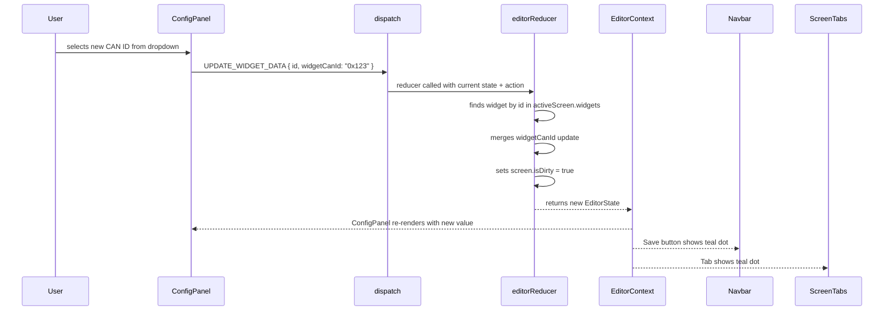

---

## 3. Save Sequence

Clicking Save in `Navbar` saves **every dirty screen** in parallel, then the DBC if `canIdsDirty`. Each screen POST triggers a backend-side cross-tab broadcast and a live `config_update` push to the Pi.

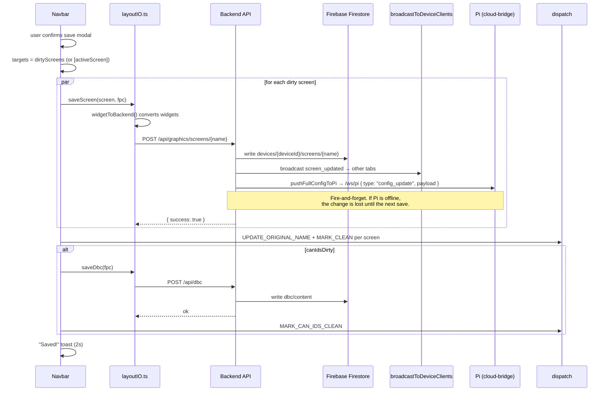

Screen prefs are **not** part of this flow — they auto-save on a separate 400 ms debounce (see §7). DBC saves do not push to the Pi (the Pi uploads its own DBC via `dbc_upload` on the captive-portal path).

---

## 4. Live Telemetry Flow

`TelemetryProvider` owns the `/ws/client` connection. `TelemetryPage`, `MapPage`, and the log terminal's live feed all read from it via `useTelemetry()`. In addition to `Telemetry` frames, the provider also handles `gps` frames — each incoming point updates `latestGps` and appends to `gpsSession`, which `MapPage` reads to draw the live track.

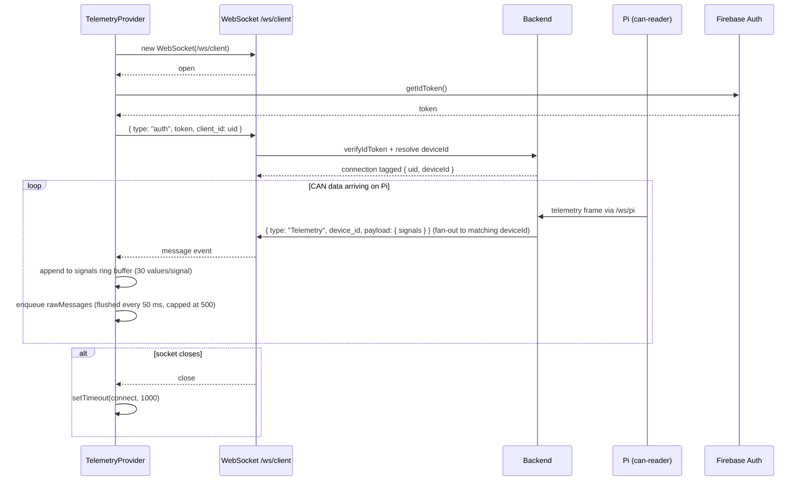

**Per-signal rendering logic (`TelemetryPage`):**

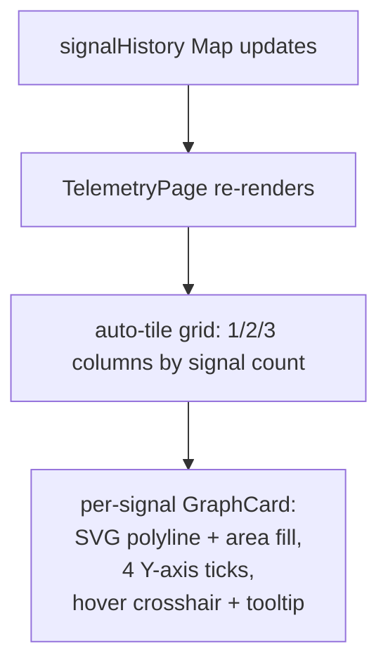

There is no longer a per-widget-type SmartSignalCard. Every live signal renders as a line graph regardless of how the editor's widget is configured.

---

## 5. Cross-Tab Sync

When one browser tab saves, deletes, or re-prefs a screen, every other tab on the **same user account** updates in place — no reload, no poll. The backend broadcasts via `/ws/client` and `TelemetryProvider` demultiplexes the events into editor dispatches.

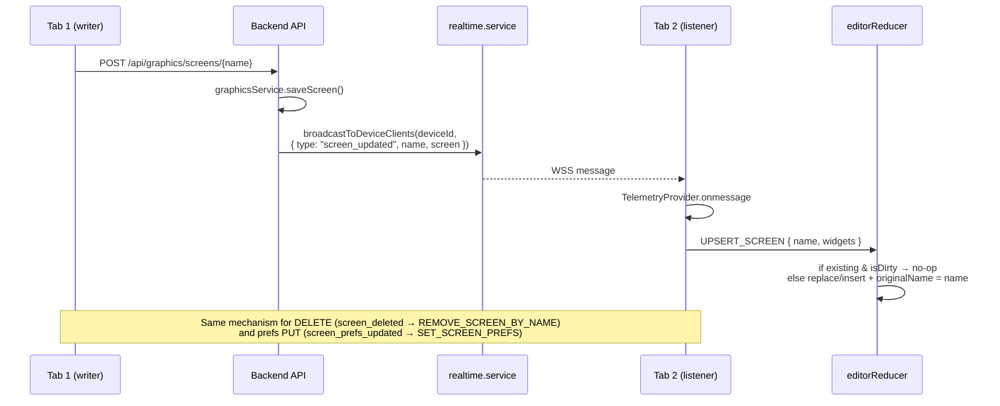

**Safety rule:** `UPSERT_SCREEN` is a no-op against a locally dirty screen — incoming broadcasts never clobber in-progress edits.

---

## 6. Log Viewer Flow

### 6a. History Panel

On mount, day summaries are fetched. The user expands a day to load its first page of entries, then paginates with a cursor.

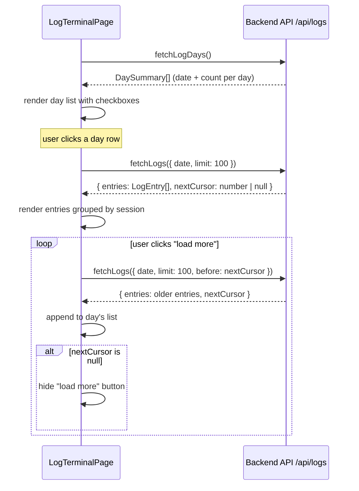

### 6b. Live Feed Panel

The right panel streams live telemetry via the existing `useTelemetry()` hook and auto-scrolls to the bottom unless the user has scrolled up.

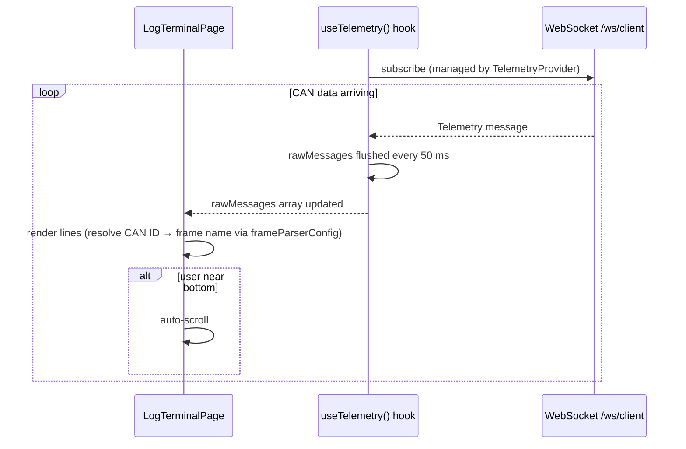

### 6c. CSV Export

Export pages through the target days (selected, filtered, or all), pivots every entry into a `timestamp × signal` grid, and writes a single CSV `Blob`.

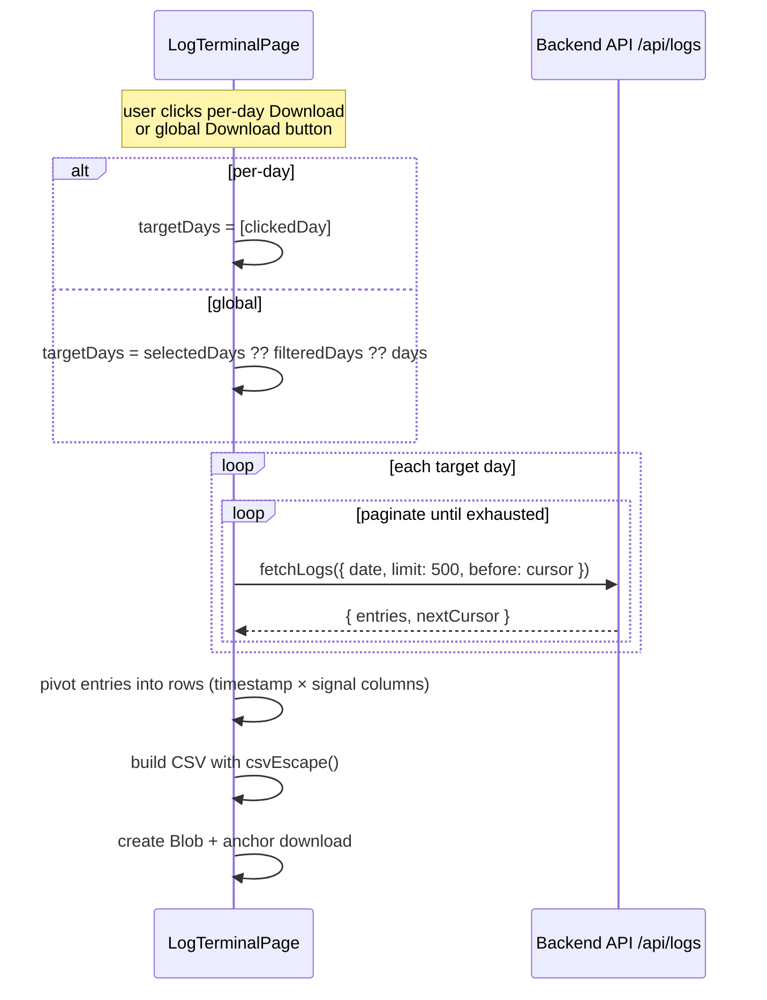

**LogEntry shape:**

```typescript
{
  ts: number           // Unix timestamp (ms)
  can_id: number       // integer CAN ID
  value: number        // decoded signal value
  session: string      // session identifier
  frame_name: string | null  // resolved from DBC, null if unknown
}
```

CSV headers are `timestamp, <signal-1>, <signal-2>, ...` where each signal column uses `frame_name ?? "0x<can_id>"` as its key. Timestamps are emitted as ISO strings.

---

## 7. Screen Prefs Auto-Save

Pin, unpin, drag-reorder, and rename all mark `prefsDirty = true`. A single effect in `EditorProvider` debounces the PUT and marks clean.

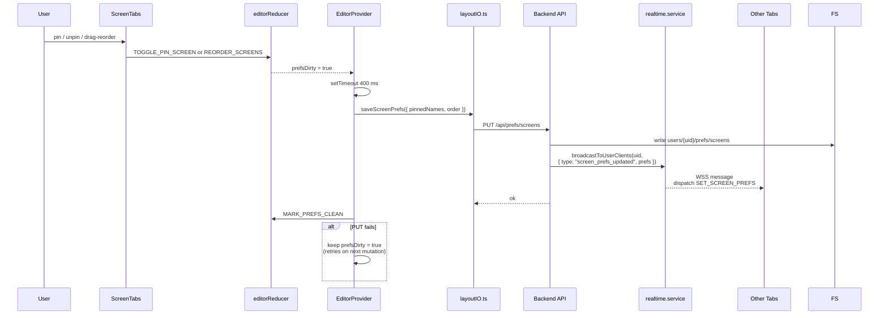

Any subsequent mutation within the 400 ms window resets the timer — the PUT only fires once the user pauses.
