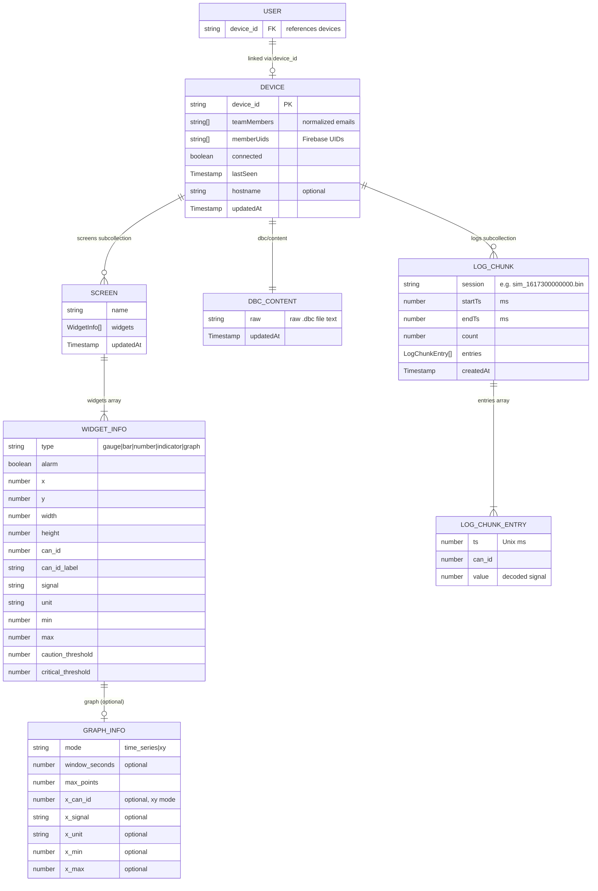

# Data Model — Firestore Schema

All persistent data is stored in Firebase Firestore. There are two top-level collections (`users`, `devices`) and three subcollections under each device.

## ER Diagram



## Collection hierarchy

```
users/
  {uid}
    - device_id: string

devices/
  {deviceId}
    - device_id: string
    - teamMembers: string[]
    - memberUids: string[]
    - connected: boolean
    - lastSeen: Timestamp
    - hostname?: string
    - updatedAt: Timestamp

    screens/{screenId}
      - name: string
      - widgets: WidgetInfo[]
      - updatedAt: Timestamp

    dbc/content
      - raw: string
      - updatedAt: Timestamp

    logs/{logChunkId}
      - session: string
      - startTs: number
      - endTs: number
      - count: number
      - entries: LogChunkEntry[]
      - createdAt: Timestamp
```

---

## Top-level collections

### `users/{uid}`

Links a Firebase Auth user to a device.

| Field | Type | Description |
|-------|------|-------------|
| `device_id` | string | References `devices/{deviceId}` |

Set by `requireAuth` middleware or device registration. Document ID is the Firebase UID.

**Source:** `middleware/auth.ts`, `modules/devices/devices.service.ts`

---

### `devices/{deviceId}`

Registered Pi device and its team membership.

| Field | Type | Description |
|-------|------|-------------|
| `device_id` | string | Unique device identifier (same as doc ID) |
| `teamMembers` | string[] | Normalized email addresses |
| `memberUids` | string[] | Firebase UIDs of team members |
| `connected` | boolean | Whether the Pi is connected via WebSocket |
| `lastSeen` | Timestamp | Last heartbeat from Pi |
| `hostname` | string (optional) | Device hostname |
| `updatedAt` | Timestamp | Server timestamp |

**Source:** `modules/devices/devices.service.ts`

---

## Subcollections (under `devices/{deviceId}`)

### `screens/{screenId}`

Dashboard screen layout consumed by the graphics-engine on the Pi.

| Field | Type | Description |
|-------|------|-------------|
| `name` | string | Screen display name |
| `widgets` | WidgetInfo[] | Array of widget configurations |
| `updatedAt` | Timestamp | Server timestamp |

#### WidgetInfo

| Field | Type | Description |
|-------|------|-------------|
| `type` | `"gauge"` \| `"bar"` \| `"number"` \| `"indicator"` \| `"graph"` | Widget type |
| `alarm` | boolean | Whether alarm thresholds are active |
| `position` | PositionInfo | Grid placement |
| `data` | DataInfo | CAN signal binding |
| `graph` | GraphInfo (optional) | Graph-specific settings |

#### PositionInfo

| Field | Type |
|-------|------|
| `x` | number |
| `y` | number |
| `width` | number |
| `height` | number |

#### DataInfo

| Field | Type | Description |
|-------|------|-------------|
| `can_id` | number | CAN message ID |
| `can_id_label` | string | Human-readable frame label |
| `signal` | string | Signal name within the CAN message |
| `unit` | string | Display unit |
| `min` | number | Minimum value |
| `max` | number | Maximum value |
| `caution_threshold` | number | Yellow alarm threshold |
| `critical_threshold` | number | Red alarm threshold |

#### GraphInfo

| Field | Type | Description |
|-------|------|-------------|
| `mode` | `"time_series"` \| `"xy"` | Graph mode |
| `window_seconds` | number (optional) | Time window for time-series mode |
| `max_points` | number | Max data points to display |
| `x_can_id` | number (optional) | X-axis CAN ID (XY mode) |
| `x_signal` | string (optional) | X-axis signal name |
| `x_unit` | string (optional) | X-axis unit |
| `x_min` | number (optional) | X-axis minimum |
| `x_max` | number (optional) | X-axis maximum |

**Source:** `modules/graphics/graphics.service.ts`, `modules/graphics/graphics.types.ts`

---

### `dbc/content` (single document)

Raw DBC file stored as text. Parsed on read via the `candied` library into `FrameDefinition` objects.

| Field | Type | Description |
|-------|------|-------------|
| `raw` | string | Raw `.dbc` file content |
| `updatedAt` | Timestamp | Server timestamp |

#### Parsed output (not stored — derived on read)

```typescript
DbcConfig {
  frames: Record<hexId, FrameDefinition>
}

FrameDefinition {
  can_id_label: string
  signals: FrameSignal[]
}

FrameSignal {
  name: string
  start_byte: number
  length: number
  type: "uint8" | "int8" | "uint16" | "int16" | "uint32" | "int32" | "float" | "double"
  scale: number
  offset: number
}
```

**Source:** `modules/dbc/dbc.service.ts`, `modules/dbc/dbc.types.ts`

---

### `logs/{logChunkId}`

Telemetry log entries uploaded by the Pi via WebSocket, stored in chunks (max 30,000 entries per document).

| Field | Type | Description |
|-------|------|-------------|
| `session` | string | Session identifier (e.g., `"sim_1617300000000.bin"`) |
| `startTs` | number | Timestamp (ms) of first entry in chunk |
| `endTs` | number | Timestamp (ms) of last entry in chunk |
| `count` | number | Number of entries in this chunk |
| `entries` | LogChunkEntry[] | Array of log entries |
| `createdAt` | Timestamp | Server timestamp |

#### LogChunkEntry

| Field | Type | Description |
|-------|------|-------------|
| `ts` | number | Unix timestamp (ms) |
| `can_id` | number | CAN message ID |
| `value` | number | Decoded signal value |

Binary format on the wire from Pi: 24 bytes per entry (`int64 ts` + `uint32 can_id` + `uint32 pad` + `double value`). Decoded and stored as JSON.

**Source:** `modules/logs/logs.service.ts`, `modules/logs/logs.types.ts`, `modules/realtime/realtime.service.ts`

---

## Notes

- All `updatedAt` / `createdAt` fields use `FieldValue.serverTimestamp()`.
- The `users` doc is created implicitly when `requireAuth` middleware or device registration links a user to a device.
- Screens are pushed to the Pi over WebSocket (`/ws/pi`) whenever they are saved.
