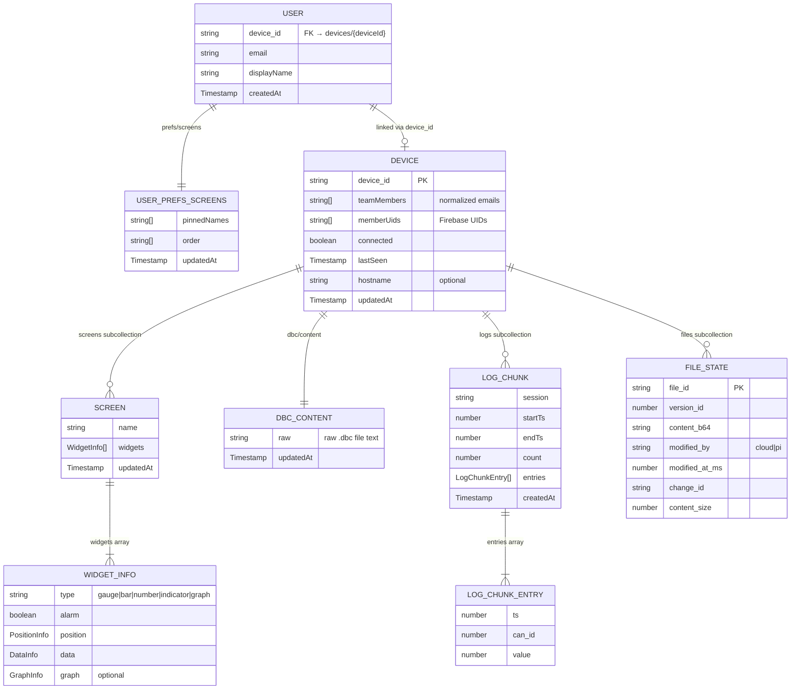

# Data Model — Firestore Schema

All persistent data lives in Firebase Firestore. There are two top-level collections (`users`, `devices`). User-scoped data (prefs) sits under `users/{uid}`; device-scoped data (screens, DBC, logs, sync files) sits under `devices/{deviceId}`.

## ER Diagram



## Collection hierarchy

```
users/
  {uid}
    - device_id: string
    - email: string
    - displayName: string
    - createdAt: Timestamp

    prefs/screens                    # single doc under the prefs subcollection
      - pinnedNames: string[]
      - order: string[]
      - updatedAt: Timestamp

devices/
  {deviceId}
    - device_id: string
    - teamMembers: string[]
    - memberUids: string[]
    - connected: boolean
    - lastSeen: Timestamp
    - hostname?: string
    - updatedAt: Timestamp

    screens/{screenId}
      - name: string
      - widgets: WidgetInfo[]
      - updatedAt: Timestamp

    dbc/content
      - raw: string
      - updatedAt: Timestamp

    logs/{logChunkId}
      - session: string
      - startTs: number
      - endTs: number
      - count: number
      - entries: LogChunkEntry[]
      - createdAt: Timestamp

    files/{fileId}                   # versioned sync store; fileId in { graphics, display_dbc }
      - file_id: string
      - version_id: number
      - content_b64: string
      - modified_by: "cloud" | "pi"
      - modified_at_ms: number
      - change_id: string
      - content_size: number
```

---

## Top-level collections

### `users/{uid}`

Firebase Auth user metadata and device link.

| Field | Type | Description |
|-------|------|-------------|
| `device_id` | string | References `devices/{deviceId}` (set by `registerDevice` or resolved on WSS auth) |
| `email` | string | From Firebase Auth user profile (written by frontend on first sign-in) |
| `displayName` | string | From Firebase Auth user profile |
| `createdAt` | Timestamp | Server timestamp of first sign-in |

**Source:** `frontend/src/AppWithAuth.tsx`, `backend/src/modules/devices/devices.service.ts`, `backend/src/modules/realtime/realtime.service.ts` (`resolveDeviceIdForUid`).

---

### `users/{uid}/prefs/screens`

Per-user screen prefs — pinned names and manual ordering of the `ScreenTabs` list. User-scoped, not device-scoped.

| Field | Type | Description |
|-------|------|-------------|
| `pinnedNames` | string[] | Screen names that are pinned to the top |
| `order` | string[] | Manual order for **unpinned** screens |
| `updatedAt` | Timestamp | Server timestamp |

**Source:** `backend/src/modules/prefs/prefs.service.ts`.

---

### `devices/{deviceId}`

Registered Pi device and its team membership.

| Field | Type | Description |
|-------|------|-------------|
| `device_id` | string | Unique device identifier (same as doc ID) |
| `teamMembers` | string[] | Normalized email addresses |
| `memberUids` | string[] | Firebase UIDs resolved from `teamMembers` |
| `connected` | boolean | Whether the Pi is currently connected via `/ws/pi` |
| `lastSeen` | Timestamp | Last heartbeat from the Pi |
| `hostname` | string? | Device hostname (optional, reported via heartbeat) |
| `updatedAt` | Timestamp | Server timestamp |

**Source:** `backend/src/modules/devices/devices.service.ts`.

---

## Subcollections (under `devices/{deviceId}`)

### `screens/{screenId}`

Dashboard screen layout consumed by the graphics-engine on the Pi. `screenId` is the screen name.

| Field | Type | Description |
|-------|------|-------------|
| `name` | string | Screen display name |
| `widgets` | WidgetInfo[] | Array of widget configurations |
| `updatedAt` | Timestamp | Server timestamp |

#### WidgetInfo

| Field | Type | Description |
|-------|------|-------------|
| `type` | `"gauge"` \| `"bar"` \| `"number"` \| `"indicator"` \| `"graph"` | Widget type |
| `alarm` | boolean | Whether alarm thresholds are active |
| `position` | PositionInfo | Grid placement |
| `data` | DataInfo | CAN signal binding |
| `graph` | GraphInfo (optional) | Graph-specific settings (only present for `type === "graph"`) |

#### PositionInfo

| Field | Type |
|-------|------|
| `x` | number (0-based column) |
| `y` | number (0-based row) |
| `width` | number (cells) |
| `height` | number (cells) |

#### DataInfo

| Field | Type | Description |
|-------|------|-------------|
| `can_id` | number | CAN message ID (integer on Firestore; pushed to the Pi as hex string by `normalizeConfigForPi`) |
| `can_id_label` | string | Human-readable frame label |
| `signal` | string | Signal name within the CAN message |
| `unit` | string | Display unit |
| `min` | number | Minimum value |
| `max` | number | Maximum value |
| `caution_threshold` | number | Yellow alarm threshold |
| `critical_threshold` | number | Red alarm threshold |

#### GraphInfo

| Field | Type | Description |
|-------|------|-------------|
| `mode` | `"time_series"` \| `"xy"` | Graph mode |
| `window_seconds` | number? | Time window (time_series mode) |
| `max_points` | number | Max data points to display |
| `x_can_id` | number? | X-axis CAN ID (xy mode) |
| `x_signal` | string? | X-axis signal name |
| `x_unit` | string? | X-axis unit |
| `x_min` | number? | X-axis minimum |
| `x_max` | number? | X-axis maximum |

**Source:** `backend/src/modules/graphics/graphics.service.ts`, `backend/src/modules/graphics/graphics.types.ts`.

---

### `dbc/content` (single document)

Raw DBC file stored as text. Parsed on read via the `candied` library into `FrameDefinition` objects.

| Field | Type | Description |
|-------|------|-------------|
| `raw` | string | Raw `.dbc` file content |
| `updatedAt` | Timestamp | Server timestamp |

#### Parsed output (not stored — derived on read)

```typescript
DbcConfig {
  frames: Record<hexId, FrameDefinition>
}

FrameDefinition {
  can_id_label: string
  signals: FrameSignal[]
}

FrameSignal {
  name: string
  start_byte: number
  length: number
  type: "uint8" | "int8" | "uint16" | "int16" | "uint32" | "int32" | "float" | "double"
  scale: number
  offset: number
}
```

**Source:** `backend/src/modules/dbc/dbc.service.ts`, `backend/src/modules/dbc/dbc.types.ts`.

---

### `logs/{logChunkId}`

Telemetry log entries uploaded by the Pi via WebSocket, stored in chunks (max 30,000 entries per document).

| Field | Type | Description |
|-------|------|-------------|
| `session` | string | Session identifier (e.g., `"sim_1617300000000"`) |
| `startTs` | number | Timestamp (ms) of first entry in chunk |
| `endTs` | number | Timestamp (ms) of last entry in chunk |
| `count` | number | Number of entries in this chunk |
| `entries` | LogChunkEntry[] | Array of log entries |
| `createdAt` | Timestamp | Server timestamp |

#### LogChunkEntry

| Field | Type | Description |
|-------|------|-------------|
| `ts` | number | Unix timestamp (ms) |
| `can_id` | number | CAN message ID |
| `value` | number | Decoded signal value |

Binary wire format from Pi: 24 bytes per entry (`int64 ts` + `uint32 can_id` + `uint32 pad` + `double value`). Uploaded as base64 chunks over `/ws/pi`, then decoded server-side and stored as JSON.

**Source:** `backend/src/modules/logs/logs.service.ts`, `backend/src/modules/realtime/realtime.service.ts`.

---

### `files/{fileId}`

Versioned snapshot store for the cloud ↔ Pi sync protocol. `fileId` is one of the sync service constants (`graphics`, `display_dbc`). Every save to `screens/` or `dbc/content` also writes a new revision here so the Pi can fast-forward on reconnect.

| Field | Type | Description |
|-------|------|-------------|
| `file_id` | string | Logical file identifier |
| `version_id` | number | Monotonic revision number |
| `content_b64` | string | File payload, base64-encoded |
| `modified_by` | `"cloud"` \| `"pi"` | Which side wrote this revision |
| `modified_at_ms` | number | Wall-clock time of commit (ms) |
| `change_id` | string | Idempotency key (UUID) — repeated `commit` calls with the same id return the same revision |
| `content_size` | number | Payload byte length |

**Source:** `backend/src/modules/sync/sync.service.ts`, `backend/src/modules/sync/sync.types.ts`.

---

## Notes

- All `updatedAt` / `createdAt` fields use `FieldValue.serverTimestamp()`.
- Every screen write is followed by a `commitCloudGeneratedGraphics(deviceId, payload)` call that rebuilds the full screen set and commits it to `files/graphics`; the resulting `sync_download` message is what actually reaches the Pi.
- The `users/{uid}` doc is written in two places: the frontend writes `email` / `displayName` / `createdAt` on sign-in; the backend writes `device_id` when the user is linked to a device (either via `registerDevice` or resolved at WSS auth).
- Backend broadcasts after every write: `screen_updated` / `screen_deleted` go to all `/ws/client` sockets matching the same `deviceId`; `screen_prefs_updated` goes to all sockets matching the same `uid`.
