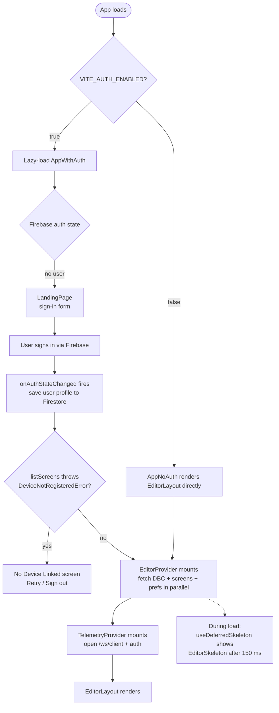
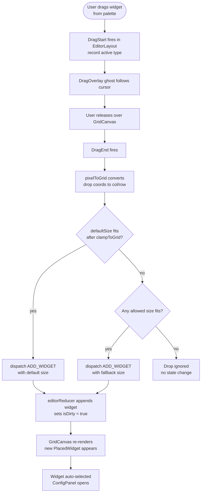
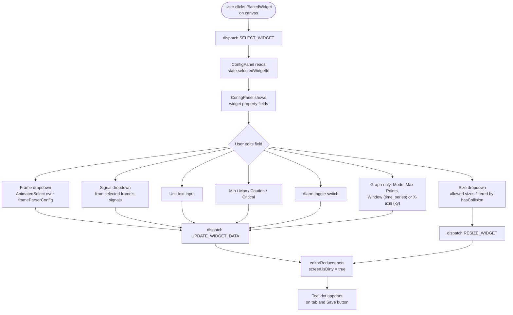
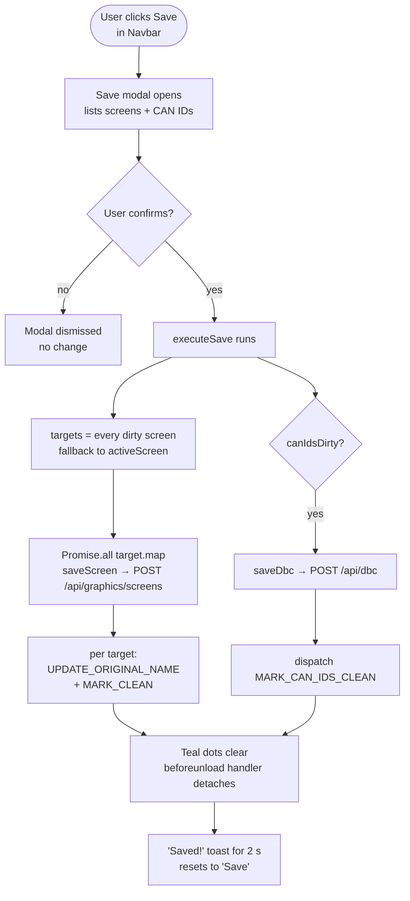
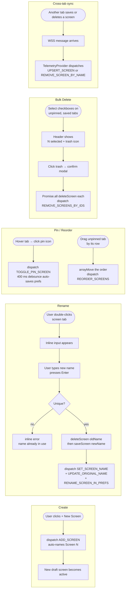
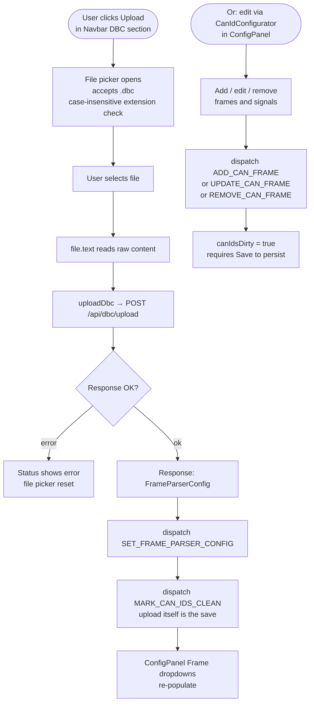
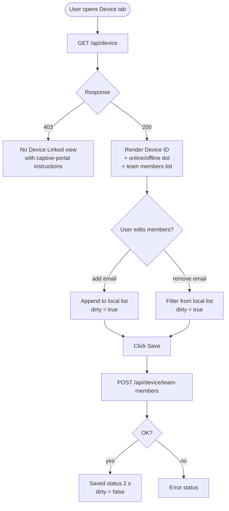

# User Flow Diagrams

These diagrams trace the key user journeys through the frontend. All flows start from the editor UI unless noted.

---

## 1. Authentication Flow

---

## 2. Widget Placement Flow

---

## 3. Widget Configuration Flow

---

## 4. Save Workflow

Screen prefs auto-save on a separate 400 ms debounce — not part of this modal flow.

---

## 5. Screen Management Flow

`UPSERT_SCREEN` is a no-op against locally dirty screens so concurrent edits across tabs don't clobber in-progress work.

---

## 6. DBC Upload Flow

DBC upload is the fast path — the backend writes `dbc/content` itself and the frontend marks clean immediately. Manual edits via `CanIdConfigurator` require a subsequent Save.

---

## 7. Device Team Management

Adding an email that corresponds to an existing Firebase user also updates `users/{uid}.device_id` on the backend, so that user gets immediate access on their next sign-in.
