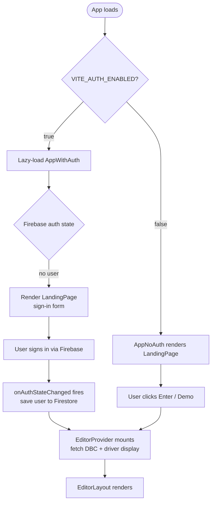
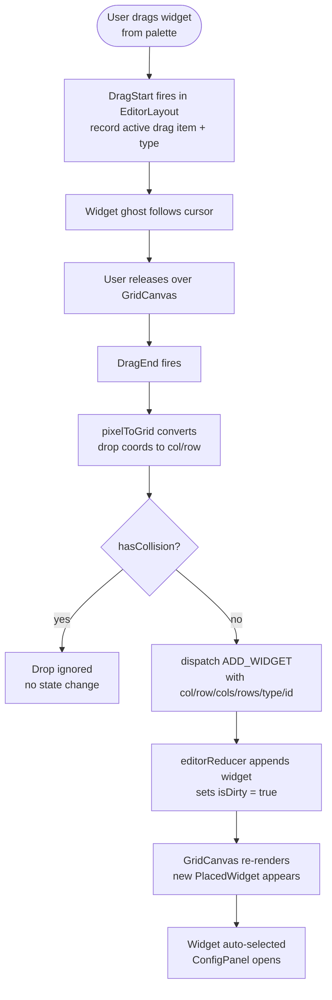
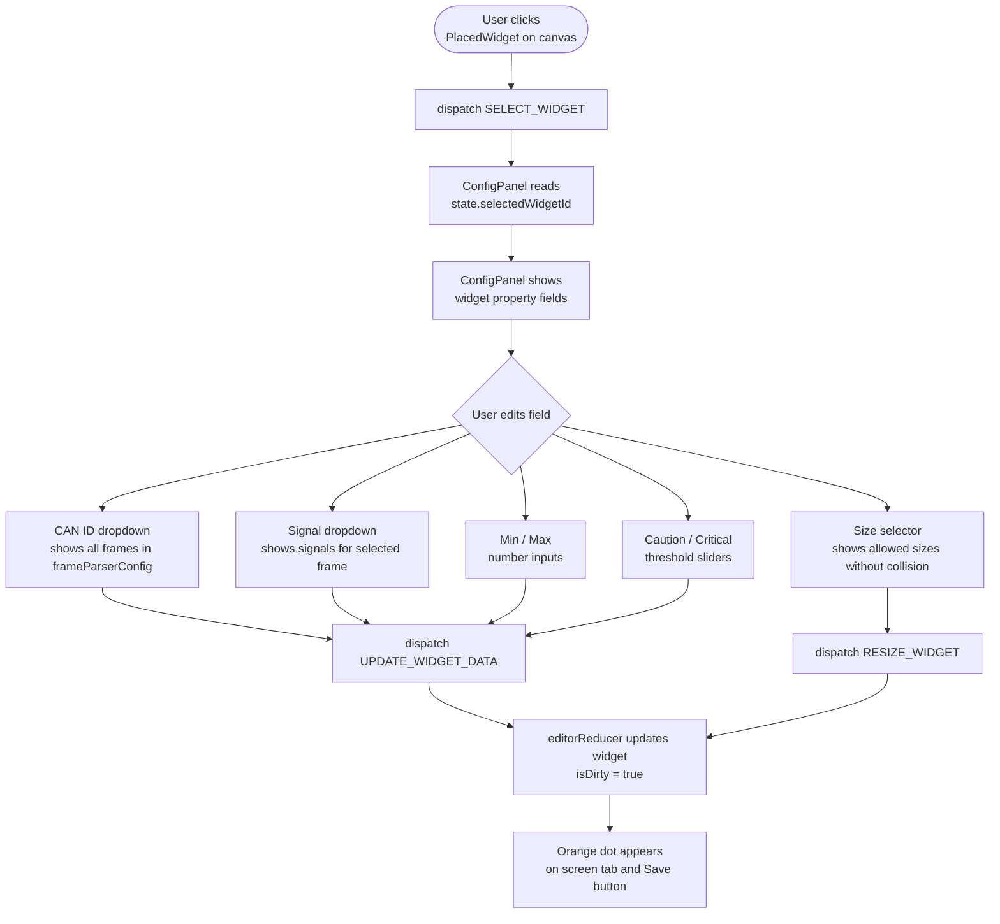
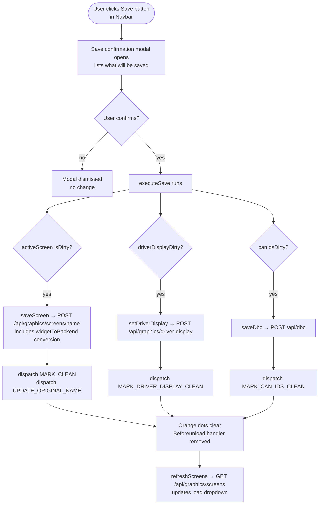
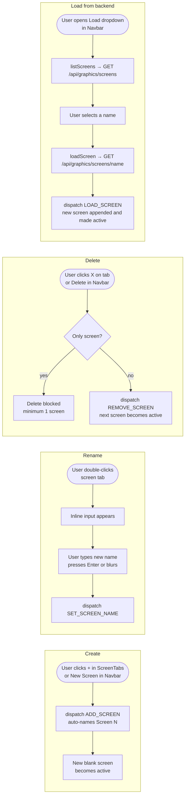
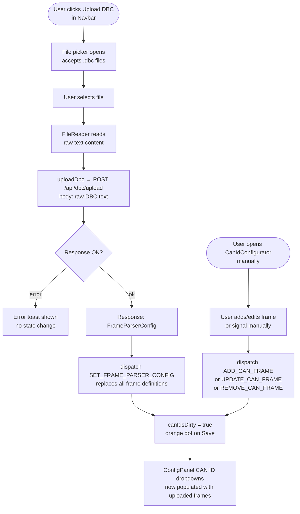

# User Flow Diagrams

These diagrams trace the key user journeys through the frontend. All flows start from the editor UI unless noted.

---

## 1. Authentication Flow

---

## 2. Widget Placement Flow

---

## 3. Widget Configuration Flow

---

## 4. Save Workflow

---

## 5. Screen Management Flow

---

## 6. DBC Upload Flow

